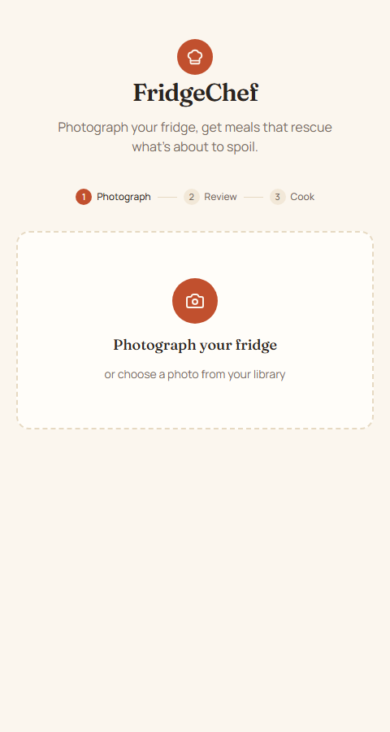
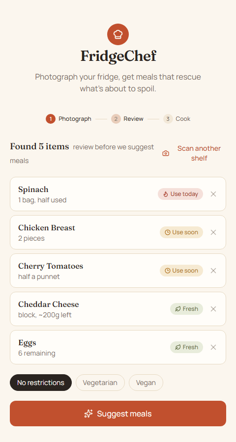
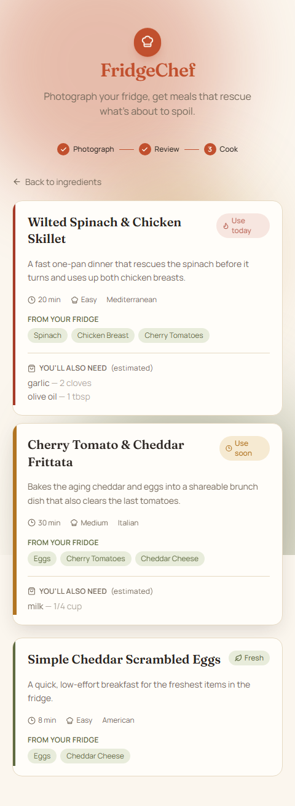

# FridgeChef

Photograph your fridge, get meal ideas that rescue what's about to spoil.

FridgeChef takes a photo of your fridge shelf, uses a vision model to detect
what's in it, scores each item by how urgently it needs to be used, and then
suggests recipes that prioritize the ingredients closest to going to waste.

## How it works

1. **Photograph** — snap a photo, drag one in, or choose one from your library.
2. **Review** — the app detects ingredients, estimates quantity/freshness,
   and lets you remove anything it got wrong before continuing. You can also
   set a dietary preference (no restrictions / vegetarian / vegan).
3. **Cook** — get a ranked list of recipes, each showing which of your
   ingredients it uses, what you'll still need to buy, prep time, and
   difficulty.

Recipes and ingredients are both tagged with a **waste-priority badge**
(`Use today` / `Use soon` / `Fresh`) so the item or dish most at risk of
spoiling stands out first.

## Screenshots

| Photograph | Review | Cook |
|---|---|---|
|  |  |  |

## Tech stack

- **[Next.js 16](https://nextjs.org)** (App Router, Turbopack) + React 19 + TypeScript
- **Tailwind CSS 4** for styling, **lucide-react** for icons, **framer-motion** for the step transitions and micro-interactions
- **Gemini** (OpenAI-compatible API) for vision (ingredient detection) and
  **Groq** (OpenAI-compatible API) for text (recipe generation) — see
  `lib/ai.ts`
- **Zod** for validating model output against the app's data schemas
- No database — everything lives in client component state for the
  duration of a session

## Project structure

```
app/
  page.tsx                 # single-page flow: upload -> confirm -> results
  api/analyze/route.ts      # POST: photo -> detected ingredients
  api/recipes/route.ts      # POST: ingredients + preference -> recipes
components/
  FridgeUploader.tsx        # camera/file input
  IngredientChip.tsx        # editable detected-ingredient row
  RecipeCard.tsx            # recipe result card
  WastePriorityBadge.tsx    # "Use today / Use soon / Fresh" badge
lib/
  ai.ts                     # Gemini/Groq clients + JSON-mode model calls
  prompts.ts                # prompts sent to the vision/text models
  schemas.ts                # Zod schemas validating model responses
  waste-priority.ts         # freshness + shelf-life -> waste-priority score
types/index.ts               # shared TypeScript types
```

## Getting started

### Prerequisites

- Node.js 20+
- A [Gemini API key](https://aistudio.google.com/apikey) (free tier works, no
  credit card required) — used for photo analysis
- A [Groq API key](https://console.groq.com/keys) (free tier works) — used
  for recipe generation

### Setup

```bash
npm install
```

Create a `.env.local` in the project root:

```bash
GEMINI_API_KEY=your-gemini-api-key
GROQ_API_KEY=your-groq-api-key
```

Then run the dev server:

```bash
npm run dev
```

Open [http://localhost:3000](http://localhost:3000).

### Available scripts

| Script | Description |
|---|---|
| `npm run dev` | Start the dev server (Turbopack) |
| `npm run build` | Production build |
| `npm run start` | Serve the production build |
| `npm run lint` | Run ESLint |

## Design notes

- **Freshness scoring** (`lib/waste-priority.ts`) blends the vision model's
  freshness read with a category-based shelf-life prior (produce spoils
  faster than pantry staples, etc.), since freshness from a photo alone is
  noisy.
- **Recipe ranking** takes the *max* waste-priority score across a recipe's
  used ingredients rather than the average — a recipe that rescues one
  near-spoiling item should outrank one that only uses shelf-stable items.
- **Vision model** is Gemini 2.5 Flash (`lib/ai.ts`) — moved off Groq because
  Groq's free tier only budgets ~6,000 tokens/minute for its vision model,
  and a flat 2,048-token charge per image made that easy to exhaust with
  normal usage. Gemini's free tier budgets ~250,000 tokens/minute with no
  credit card required. Recipe generation stays on Groq (no image cost, no
  rate-limit pressure). Both are called through the OpenAI SDK against each
  provider's OpenAI-compatible endpoint, so swapping either one again is a
  base-URL + model-name change, not a rewrite.
- **Motion** — an animated ambient gradient background, spring-based step
  transitions, staggered ingredient/recipe entrances, and a scanning
  animation with cycling status text while a photo is being analyzed
  (all `framer-motion`, see `app/page.tsx` and `components/FridgeUploader.tsx`).
